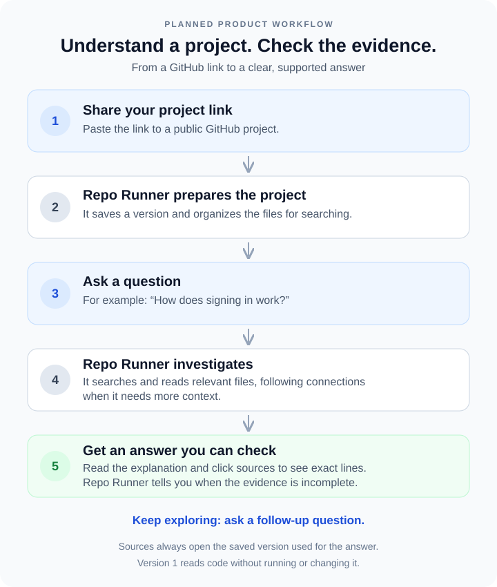

# Repo Copilot
AI developer assistant that can ingest a repository, understand its structure, answer codebase questions with file/line citations, trace flows across files, and eventually analyze proposed changes.

The product combines code-aware hybrid retrieval, deterministic repository tools, and a single tool-using agent. Answers are grounded in an immutable repository snapshot and include clickable, validated source citations.

## How it will work

## First success criterion

Given a public GitHub repository URL and a pinned commit, answer “Where is authentication implemented?” with supporting file and line citations—or explain when the inspected evidence is insufficient to establish an authentication implementation.

## Implementation plan

See [the step-by-step implementation plan](docs/implementation-plan.md) for the agreed architecture, data model, delivery phases, acceptance criteria, and advanced roadmap.

The first delivery is a Python command-line prototype with exact and semantic retrieval and a small evaluation dataset. The second adds background indexing, FastAPI, a bounded repository agent, and a Next.js workspace. Python, JavaScript, JSX, TypeScript, and TSX source parsing are implemented.

## Planned stack

| Layer | Technology |
| --- | --- |
| Frontend | Next.js, TypeScript, Tailwind, shadcn/ui |
| API and worker | Python, FastAPI, native Git CLI |
| Parsing | Python AST; Tree-sitter for JavaScript/TypeScript |
| Retrieval and storage | PostgreSQL with pgvector, exact code search |
| Agent | LangChain; custom LangGraph workflow when needed |
| Observability and evaluation | Structured local traces; optional LangSmith |
| Streaming and deployment | Server-Sent Events, Docker Compose |

## Scope

Version 1 supports public repositories, read-only investigation, repository trees, file viewing, hybrid search, cited Q&A, streaming, and conversation history. Repository code is never executed during ingestion or investigation.

Architecture explanations, flow tracing, and change-impact analysis follow once repository Q&A meets the evaluation gates. Code modification, private repositories, pull requests, and multi-agent workflows are outside version 1.

## Development

Step 1 is implemented: backend packaging, configuration, typed contracts, provider interfaces, a smoke CLI, and PostgreSQL/pgvector migration setup. See [backend setup and short explanations](backend/README.md) for commands and why each piece exists.

Step 2 adds a controlled Python fixture, 20 evaluation questions, pinned public repositories, and dataset/result formats. See the [evaluation guide](evals/datasets/README.md) for validation commands and the review rubric.

Step 3 adds safe public GitHub ingestion, source manifests, and immutable database snapshots. See the [ingestion guide](backend/app/ingestion/README.md) for the command and a short explanation of each component.

Step 4 adds Python symbol/import extraction and versioned source chunks, with text fallback for other languages and malformed files. See the [parsing guide](backend/app/ingestion/PARSING.md).

Step 5 adds repository inspection, local lexical search, and an OpenAI-backed semantic/hybrid search path with caching. See the [retrieval guide](backend/app/retrieval/README.md) for setup and the first retrieval baseline. Live semantic quality evaluation needs an API key; local search and infrastructure tests run without one.

Step 6 adds a repository Q&A CLI with structured answers, validated citations, one bounded repair attempt, and optional JSON traces. See the [answering guide](backend/app/answering/README.md). Live answer quality remains to be measured in Step 7.

Step 7 adds the [baseline evaluation workflow](backend/app/evaluation/README.md) with per-case traces, usage/cost estimates, citation checks, and human review. The [initial report](evals/reports/development-baseline-v1.md) records 82.1% lexical file recall. A [saved live hybrid run](evals/reports/development-live-v4.md) answered 14 development questions with 92.9% file recall and valid citation provenance. The resumed v4 completeness-review implementation passes local and database tests; your human review now passes all gates for that saved run. Fresh live measurement of the current code remains pending.

The frontend is available as a local Next.js workspace; see the [frontend setup](frontend/README.md).

Step 8 adds [JavaScript/TypeScript parsing](backend/app/ingestion/PARSING.md), ES import/export metadata, visible extraction limitations, and a separate six-question web-language dataset. Web-language model quality is not yet measured; Step 10 separately measures fresh Python development answers.

Step 9 adds the [FastAPI service](backend/app/api/README.md) and [persisted indexing worker](backend/app/jobs/README.md). Submit a repository, poll its job, browse a published snapshot, and ask a cited question. Jobs have heartbeats, bounded retries, and recovery; failed replacement indexes preserve existing ready snapshots. Step 10 adds an opt-in [bounded repository agent](backend/app/agents/README.md) with audited tool calls, enforced budgets, and validated citations. All 247 tests pass with PostgreSQL integration enabled. Step 11 adds [pinned conversations and resumable streaming](backend/app/conversations/README.md), with idempotent submissions, cancellation, and a separate answer worker.

Step 12 adds the [Next.js repository workspace](frontend/README.md): repository submission, indexing progress, saved-commit selection, file browsing, cited chat, source highlighting, conversation history, and responsive panels. Run the API, indexing worker, and answer worker, then run `npm ci` and `npm run dev` from `frontend/`. Open http://localhost:3000. Browser integration tests use the real API and PostgreSQL with deterministic providers and no paid calls. The next step is Step 13: version 1 validation and packaging.
